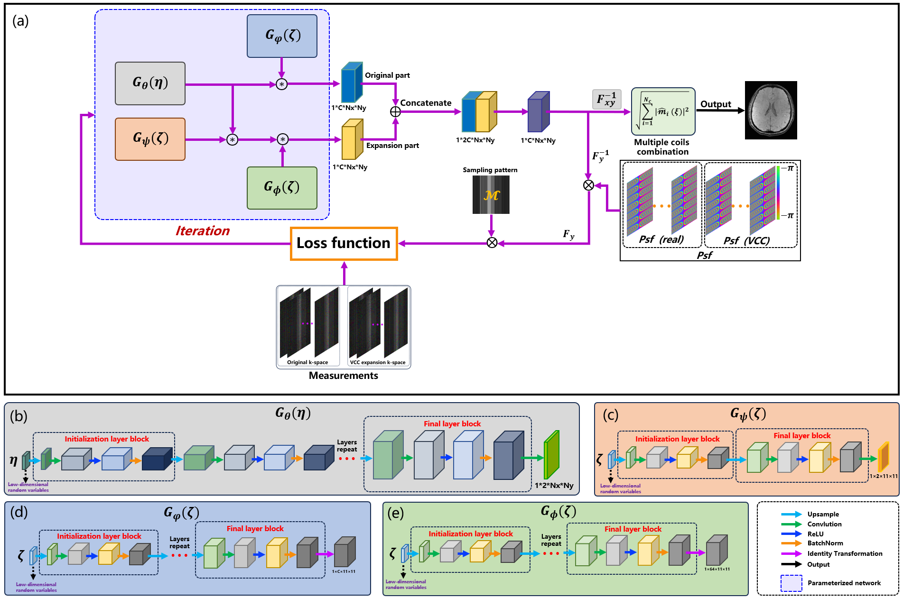

<h1 align="center">DPP: Deep Phase Prior for Parallel Imaging with Wave Encoding</h1>

Official code for the paper "[DPP: Deep Phase Prior for Parallel Imaging with Wave Encoding](https://pubmed.ncbi.nlm.nih.gov/38608645/)", published in PMB 2024.

by [Congcong Liu\*](https://scholar.google.com/citations?user=jGnxZdsAAAAJ&hl=zh-CN), [Zhuo-Xu Cui\*](https://scholar.google.com/citations?user=QZx0xdgAAAAJ&hl=zh-CN), [Sen Jia](https://scholar.google.com/citations?user=aCcLh1oAAAAJ&hl=en), [Jing Cheng](https://scholar.google.com/citations?user=voDu8Y4AAAAJ&hl=zh-CN), [Yuanyuan Liu](https://scholar.google.com/citations?user=Jjf2SSQAAAAJ&hl=zh-CN), Ling Lin, Zhanqi Hu, Taofeng Xie, [Yihang Zhou](https://scholar.google.com/citations?user=l_O7i1oAAAAJ&hl=en), [Yanjie Zhu](https://scholar.google.com/citations?user=X2mIoQ4AAAAJ&hl=en), [Dong Liang](https://scholar.google.com/citations?user=3cAJWoIAAAAJ&hl=zh-CN), Hongwu Zeng+, and [Haifeng Wang\+](https://scholar.google.com/citations?user=Ao4Q2uAAAAAJ&hl=en).

(*denotes equal contribution, +denotes corresponding author).

### Illustration


### Abstract 
##### Objective: 
In MR parallel imaging with virtual channel-expanded Wave encoding, limitations are imposed on the ability to comprehensively and accurately characterize the background phase. These limitations are primarily attributed to the calibration process relying solely on center low-frequency ACS data for calibration. 
##### Approach: 
To tackle the challenge of accurately estimating the background phase in wave encoding, a novel deep neural network model guided by deep phase priors (DPP) is proposed with integrated virtual conjugate coil (VCC) extension. Concretely, within the proposed framework, the background phase is implicitly characterized by employing a carefully designed decoder convolutional neural network, leveraging the inherent characteristics of phase smoothness and compact support in the transformed
domain. Furthermore, the proposed model with wave encoding benefits from additional priors, which incorporate transmission sparsity of the latent image and coil sensitivity smoothness.
##### Main results: 
Ablation experiments confirm the capability of the proposed DPP model to characterize the background phase accurately. Here, the superiority of the proposed methods is supported by acceleration experiments of acceleration factors 4 and 5, including T1-weighted and T2-weighted imaging. In achieving 4-fold and 5-fold acceleration, the optimal quantitative metrics (PSNR/SSIM/NMSE) are 44.1359 dB/0.9863/0.0008 (4-fold) and 41.2074/0.9846/0.0017 (5-fold), respectively. The DPP delivered much better performance than the conventional methods by exploring accelerated phase-sensitive SWI imaging. In SWI accelerated imaging, it also surpasses the optimal competing method in terms of (PSNR/SSIM/NMSE) with 0.096%/0.009%/0.0017%.

## Setup
The following will introduce environment setup, data preparation, usage instructions, and a quick start guide. 

### Dependencies
Run the following to install a subset of necessary Python packages for our code
```sh
pip install -r requirements.txt
```
* 'Note': The CUDA version required must be 11.2 or higher.

## Data Preparation

### Illustrative data
We provide exemplary data to facilitate the replication of our work, aspiring to contribute to the field of scientific research. Due to privacy considerations, we are unable to make all data publicly available. However, this does not impede the overall reproducibility and comprehension of our work.

**Code Functional Hierarchy Description**: the description of the whole code is a combination of the following viewers:
    
    * main.py *: Running the main function, including loss calculations, etc.
    * utils_np.py *: Functional function, including functions such as Fourier transform, crop, etc.
    * data_proc.py *: Data preprocessing functions, including data reading, transforming, cropping, etc.
     

These datasets can be downloaded at [here](https://pan.baidu.com/s/1hSL922TcgTWxgomhB0Ailg 
) 

提取码：caqz

You need to download the data to a specified folder and specify the data path in 'data_proc.py' to the path where you downloaded the data.
  
## Usage

The study encompasses only the implicit training process executed via "main.py". The user only needs to execute "main.py" and save the results upon completion of the iteration. If you wish to use your own data, adjustments to the "lr_G" and "gain" parameters in "main.py" may be necessary. Our experiments have demonstrated that these two parameters are of primary importance. However, this is not absolute; adjustments to other parameters might also be needed if your work incorporates them.


## References
The author would like to thank Dr. Zhilang Qiu for the helpful discussion. Our implementation was inspired by [Mohammad Zalbagi Darestani](https://scholar.google.com/citations?hl=en&user=Vk6qMDcAAAAJ&view_op=list_works); we are grateful for their contributions.
The authors also thank Dr. Michael Lusting for Sharing the parallel imaging codes at [here](https://people.eecs.berkeley.edu/~mlustig/Software.html) to estimate CSM. 

If you find the code useful for your research, please consider citing

```bib
@article{liu2024dpp,
  title={DPP: deep phase prior for parallel imaging with wave encoding},
  author={Liu, Congcong and Cui, Zhuo-Xu and Jia, Sen and Cheng, Jing and Liu, Yuanyuan and Lin, Ling and Hu, Zhanqi and Xie, Taofeng and Zhou, Yihang and Zhu, Yanjie and others},
  journal={Physics in Medicine \& Biology},
  volume={69},
  number={10},
  pages={105013},
  year={2024},
  publisher={IOP Publishing}}
```
## Questions

If you have any problem, please contact liuc23539@gmail.com


